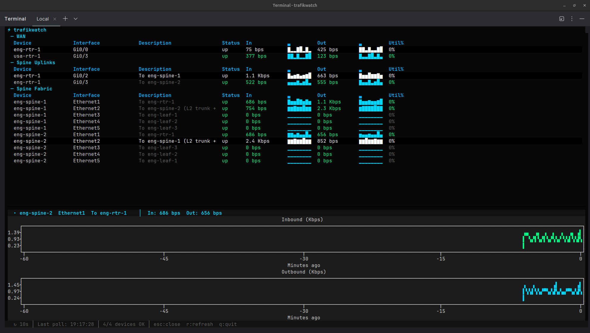

# trafikwatch

Real-time SNMP interface monitoring from the terminal. Built for watching interfaces during change windows.


## What It Does

trafikwatch polls SNMP interface counters and displays live traffic rates, sparkline history, utilization, and interface descriptions in a terminal dashboard. Select any interface to open a split-screen detail view with scrolling line charts of inbound and outbound traffic history.

Designed for network engineers who need eyes on a handful of critical interfaces during maintenance windows, migrations, and cutovers.

- **Discover** interfaces on a device via SNMP walk
- **Generate** YAML config from discovery output
- **Monitor** grouped interfaces in a live TUI dashboard
- **Drill down** into any interface for 1-hour historical trend charts
- **Mixed SNMP versions** — v1, v2c, and v3 (authPriv) per-target in a single config

## Dashboard



Press **Enter** on any row to open a split-screen detail panel with historical line charts. Charts show up to 1 hour of history, building from the right as data accumulates. Both directions auto-scale to the same unit (bps/Kbps/Mbps/Gbps) for easy comparison. Press **Esc** to close the detail view.

### Keyboard Shortcuts

| Key | Action |
|-----|--------|
| `Enter` | Open detail view for selected interface |
| `Esc` | Close detail view (or quit if detail is closed) |
| `q` | Quit |
| `r` | Force immediate refresh |

## Quick Start

```bash
# Clone and install
git clone https://github.com/scottpeterman/trafikwatch.git
cd trafikwatch
python -m venv .venv
source .venv/bin/activate
pip install -e .

# Discover interfaces (v2c)
python -m trafikwatch --discover 172.16.128.6 --community lab

# Discover interfaces (v3)
python -m trafikwatch --discover 172.16.2.2 --snmp-version 3 \
  --v3-user cisco --v3-auth-password cisco123 --v3-priv-password cisco123

# Generate a config snippet
python -m trafikwatch --discover 172.16.128.6 --community lab --yaml

# Launch the dashboard
python -m trafikwatch --config trafikwatch.yaml

# Launch with debug logging (TUI-safe, logs to file)
python -m trafikwatch --config trafikwatch.yaml --log /tmp/tw.log
```

## Requirements

- Python 3.10 or higher
- SNMP v2c or v3 access to target devices (IF-MIB)

### Dependencies

| Package | Purpose |
|---------|---------|
| pysnmp ≥ 7.1 | Async SNMP polling (v2c and v3) |
| textual ≥ 7.0 | Terminal UI framework |
| pyyaml ≥ 6.0 | Config file parsing |
| rich ≥ 14.0 | Text styling and formatting |
| textual-plotext ≥ 1.0 | Split-screen historical line charts |

## Config Format

### SNMPv2c (default)

```yaml
# trafikwatch.yaml — v2c only
community: "lab"
version: "2c"
interval: 10s
timeout: 5s
port: 161
max_history: 360    # samples to retain (360 × 10s = 1 hour)

groups:
  - name: "WAN"
    targets:
      - host: "172.16.128.6"
        label: "eng-rtr-1"
        interfaces:
          - "Gi0/0"              # To usa-rtr-1

      - host: "172.16.128.5"
        label: "usa-rtr-1"
        interfaces:
          - "Gi0/3"              # To eng-rtr-1
```

### Mixed v2c / v3

Version is resolved per-target: a target's `version` overrides the global default, and `snmpv3` credentials cascade the same way. Targets without a `version` override inherit the global setting, so you can migrate devices to v3 incrementally.

```yaml
# trafikwatch.yaml — mixed v2c and v3
community: "lab"
version: "2c"
interval: 10s
timeout: 5s
port: 161
max_history: 360

# Global v3 credentials — used by any target with version: "3"
snmpv3:
  username: "cisco"
  auth_protocol: "sha"         # sha, md5
  auth_password: "cisco123"
  priv_protocol: "aes128"      # aes128, aes192, aes256, des
  priv_password: "cisco123"

groups:
  - name: "WAN"
    targets:
      - host: "172.16.128.6"
        label: "eng-rtr-1"
        # No version override — inherits global "2c" + community "lab"
        interfaces:
          - "Gi0/0"

  - name: "Spine Fabric"
    targets:
      - host: "172.16.2.2"
        label: "eng-spine-1"
        version: "3"             # v3 — uses global snmpv3 creds
        interfaces:
          - "Ethernet1"
          - "Ethernet2"

      - host: "172.16.2.6"
        label: "eng-spine-2"
        version: "3"
        # Per-target v3 override (inherits unspecified fields from global)
        snmpv3:
          username: "monitoring"
          auth_password: "other_pass"
          priv_password: "other_pass"
        interfaces:
          - "Ethernet1"
          - "Ethernet2"
```

Per-target `community`, `port`, `version`, and `snmpv3` overrides are supported. Use `--discover` with `--yaml` to generate target blocks from live devices.

### SNMPv3 Config Reference

| Field | Default | Values |
|-------|---------|--------|
| `username` | *(required)* | SNMPv3 USM username |
| `auth_protocol` | `sha` | `sha`, `md5` |
| `auth_password` | | Authentication passphrase |
| `priv_protocol` | `aes128` | `aes128`, `aes192`, `aes256`, `des` |
| `priv_password` | | Privacy passphrase |

Security level is inferred: if `priv_password` is set, `authPriv`; if only `auth_password`, `authNoPriv`; otherwise `noAuthNoPriv`.

**Note:** AES-192 and AES-256 require pysnmp to be built with Blumenthal AES support. Most net-snmp CLI tools (`snmpget`, `snmpwalk`) only support AES-128 — use AES-128 for lab environments or test with pysnmp directly.

## Discovery

Walk a device to see all interfaces:

```bash
# v2c discovery
python -m trafikwatch --discover 172.16.2.2 --community lab

# v3 discovery
python -m trafikwatch --discover 172.16.2.2 --snmp-version 3 \
  --v3-user cisco --v3-auth-password cisco123 --v3-priv-password cisco123

  Host: 172.16.2.2 — 18 interfaces discovered

  Index    ifName       ifDescr      ifAlias                              Speed      Status
  ──────── ──────────── ──────────── ──────────────────────────────────── ────────── ──────
  1        Ethernet1    Ethernet1    To eng-rtr-1                          1 Gbps    up
  2        Ethernet2    Ethernet2    To eng-spine-2 (L2 trunk + L3 VLAN)  1 Gbps    up
  3        Ethernet3    Ethernet3    To eng-leaf-1                         1 Gbps    up
  4        Ethernet4    Ethernet4    To eng-leaf-2                         1 Gbps    up
  5        Ethernet5    Ethernet5    To eng-leaf-3                         1 Gbps    up
  2000011  Vlan11       Vlan11       Management                                     up
  2000050  Vlan50       Vlan50       Inter-Spine L3 Communication                   up
  2000210  Vlan210      Vlan210      ENG-Servers-1                                  up
  2000211  Vlan211      Vlan211      ENG-Servers-2                                  up
  2000212  Vlan212      Vlan212      ENG-Servers-3                                  up
```

Generate a config snippet:

```bash
python -m trafikwatch --discover 172.16.2.2 --community lab --yaml
```

Use `--all` to include interfaces that are operationally down.

## CLI Reference

```
usage: trafikwatch [-h] [--config CONFIG] [--version] [--discover HOST]
                   [--community COMMUNITY] [--port PORT] [--yaml] [--all]
                   [--snmp-version {1,2c,3}]
                   [--v3-user USER] [--v3-auth-protocol {sha,md5}]
                   [--v3-auth-password PASS] [--v3-priv-protocol {aes,aes128,aes192,aes256,des}]
                   [--v3-priv-password PASS]
                   [--debug] [--log FILE]

Modes:
  Monitor:   trafikwatch --config trafikwatch.yaml
  Discover:  trafikwatch --discover 10.0.1.1 --community public
  YAML gen:  trafikwatch --discover 10.0.1.1 --community public --yaml
  v3 disc:   trafikwatch --discover 10.0.1.1 --snmp-version 3 --v3-user cisco \
               --v3-auth-password pass --v3-priv-password pass

Options:
  --config, -c           Path to config file (default: trafikwatch.yaml)
  --version, -V          Print version and exit
  --discover, -d         Discover interfaces on a host
  --community            SNMP community string for v2c (default: public)
  --port                 SNMP port (default: 161)
  --yaml, -y             Output YAML config snippet from discovery
  --all, -a              Include down interfaces in discovery
  --snmp-version         SNMP version: 1, 2c, or 3 (default: 2c)
  --v3-user              SNMPv3 username
  --v3-auth-protocol     SNMPv3 auth: sha or md5 (default: sha)
  --v3-auth-password     SNMPv3 auth passphrase
  --v3-priv-protocol     SNMPv3 priv: aes128, aes192, aes256, des (default: aes128)
  --v3-priv-password     SNMPv3 priv passphrase
  --debug                Enable debug logging to stderr
  --log, -l              Log to file at debug level (TUI-safe)
```

## Logging

The `--log` flag writes debug-level logs to a file, which is safe to use alongside the TUI:

```bash
# In one terminal — run the dashboard
python -m trafikwatch -c trafikwatch.yaml --log /tmp/tw.log

# In another terminal — watch the logs
tail -f /tmp/tw.log
```

Logs include SNMP walk results, interface name resolution, raw varbind responses, rate calculations, and error details. Useful for diagnosing SNMP connectivity issues, interface name mismatches, and counter anomalies.

## Project Structure

```
trafikwatch/
├── __init__.py
├── __main__.py          # CLI entry point
├── config.py            # YAML config loader (v2c + v3)
├── models.py            # InterfaceStats, RateSample, SNMPv3Config, sparkline, format_rate
├── snmp/
│   ├── __init__.py
│   ├── engine.py        # SNMPPoller: shared engine, transport cache, v2c/v3 credentials
│   └── discover.py      # Interface discovery + YAML generation (v2c + v3)
└── tui/
    ├── __init__.py
    ├── app.py           # Textual dashboard: tables, detail panel, poll timer
    └── theme.tcss       # Dark terminal theme with split-screen layout
```

## Design Notes

- **Shared SnmpEngine** — Single engine instance for the app lifetime. Transports are cached per host:port and reused across poll cycles.
- **Per-target SNMP versioning** — Each target resolves its own SNMP version and credentials independently, allowing mixed v2c/v3 environments in a single config file. Version and credentials cascade: per-target → global.
- **Async-native** — pysnmp async API + Textual's async workers. Everything runs in a single event loop with no threads.
- **Counter wrap detection** — Negative deltas from device reloads or counter resets skip the rate calculation instead of producing false spikes.
- **In-memory ring buffer** — Each interface retains up to `max_history` samples (default 360 = 1 hour at 10s intervals). The sparklines and detail charts both read from this buffer.
- **Graceful degradation** — If `textual-plotext` is not installed, the dashboard works normally without the detail chart view.
- **Multi-vendor** — Tested against Cisco IOS/IOSv, Arista EOS, and Juniper Junos. Uses IF-MIB (ifName/ifDescr/ifAlias) which is vendor-agnostic.

## License

MIT